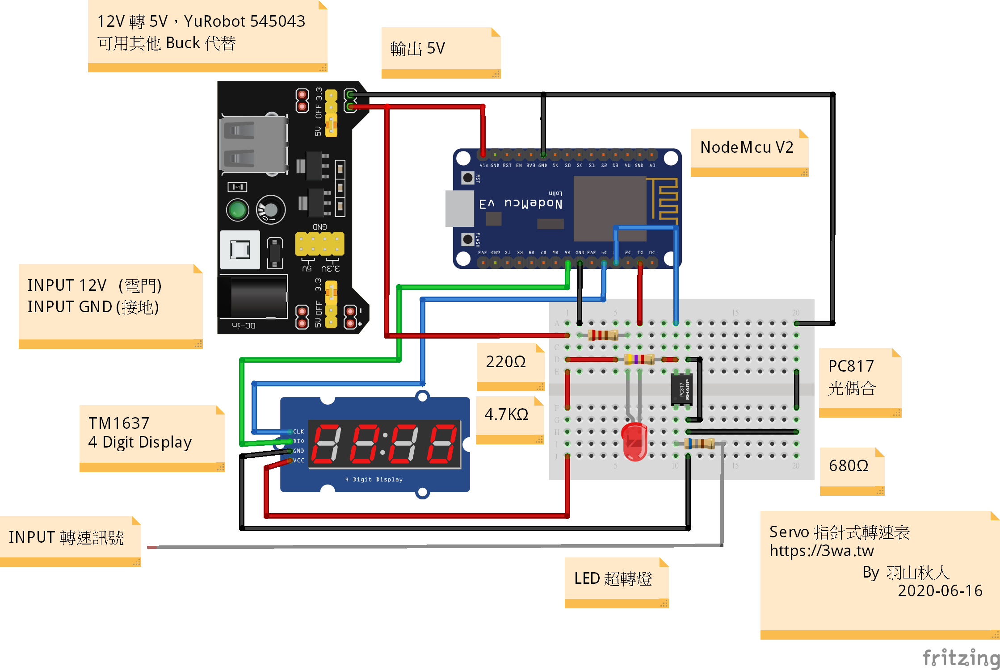
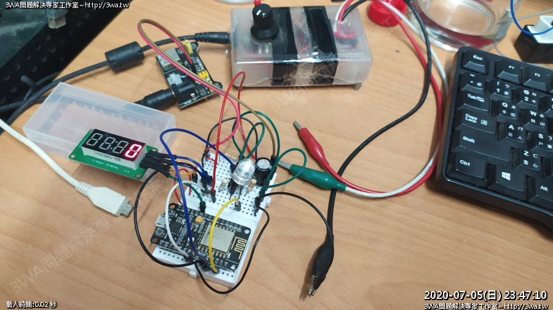

<h3>功能：</h3>
使用 Nodemcu V2 + 4 Digit Display TM1637 製作轉速表 
 
<h3>作者：</h3>
羽山秋人 http://3wa.tw  
 
<h3>版本資訊</h3>
最初開發日期：2020-07-06 12:46 
最後更新日期：2020-07-06 12:46 
版本：V0.2 
 
<h3>說明：</h3>
　　利用 Arduino Nodemcu 開發的 4Bit 七段顯示器版本，可以讀取 CDI 頻率，將讀到的轉速，轉換成數值，顯示 萬千百十，超轉燈從 8000rpm 以後至 14000rpm 亮燈。 
　　轉速表讀入訊號的部分參考 stm32-learning 霍爾轉速表 ，直接在 loop 前半段利用每一個 pulse 經過的時間計算，額外加入引擎停止、濾雜訊的方法。　
   
<h3>引擎讀入的轉速換算參考：</h3>
  
  參考：http://stm32-learning.blogspot.com/2014/05/arduino.html 
  轉速   100 轉 = 每分鐘   100 轉，每秒  1.67 轉，1轉多少秒呢，一轉 = 0.598802   秒 = 598.802 ms = 598802us 
  轉速   200 轉 = 每分鐘   200 轉，每秒  3.3  轉，1轉多少秒呢，一轉 = 0.300003   秒 = 300.003 ms = 300003us 
  轉速   600 轉 = 每分鐘   600 轉，每秒  10   轉，1轉多少秒呢，一轉 = 0.1        秒 = 100.000 ms = 100000us 
  轉速  1500 轉 = 每分鐘  1500 轉，每秒  25   轉，1轉多少秒呢，一轉 = 0.04       秒 =  40.000 ms =  40000us 
  轉速  6000 轉 = 每分鐘  6000 轉，每秒  60   轉，1轉多少秒呢，一轉 = 0.01666... 秒 =  16.667 ms =  16667us 
  轉速 14000 轉 = 每分鐘 14000 轉，每秒 233.3 轉，1轉多少秒呢，一轉 = 0.0042863. 秒 =   4.286 ms =   4286us 
  轉速 16000 轉 = 每分鐘 16000 轉，每秒 266.6 轉，1轉多少秒呢，一轉 = 0.0037500. 秒 =   3.750 ms =   3750us 
   
     
<h3>所需套件：</h3>
　　1、ArduinoSort 排序使用：https://github.com/emilv/ArduinoSort 
　　2、Grove TM1637 套件：https://github.com/Seeed-Studio/Grove_4Digital_Display 
<h3>接腳說明：</h3>
　　D1：用來連接 LED，大於 8000rpm 會有超轉燈亮起 
　　D3：PWM 接角，可以接收經過 PC817 過濾後的轉速訊號 
　　D4：TM1637 CLK 
　　D5：TM1637 DIO
 
<h3>電路圖：</h3>

 
<h3>實作照片：</h3>

 
<h3>參考影片：</h3>
<a href="screenshot/video/1.mp4">影片 1</a> 
FZR150 自製轉速表 - Part2：https://3wa.tw/blog/blog.php?uid=shadow&id=1862 
 
<h3>其他參考資料：</h3>
<ul>
  <li>1、抓取引擎訊號的二種解法： https://kokoraskostas.blogspot.com/2013/12/arduino-inductive-spark-plug-sensor.html 
    為了解決 12000rpm 以上的轉速抓取，作了一些語法的改良</li>
  <li>2、PC817 (光偶合器，如：TLP 621、TLP 421) 的使用方法： 
    機器人零件指南 / Ohmsha編著; 沈鄉吟譯   
    http://wyj-learning.blogspot.com/2017/10/arduino-04pc817.html 
    小老婆機車資訊網，尋找 killPeople 大大分享的 8051 轉速表的文章 
    </li>
  <li>3、呼吸燈： 
    http://web.htjh.tp.edu.tw/B4/106iot/NodeMCU%E4%BD%BF%E7%94%A8%E4%BB%8B%E7%B4%B9.pdf 
    </li>
  <li>4、Gensou 的 呼吸燈影片教學 
    https://www.youtube.com/watch?v=27GkMk8ct0s </li>
  <li>5、stm32-learning [Arduino]霍爾轉速表  
    http://stm32-learning.blogspot.com/2014/05/arduino.html</li>
  <li>6、Arduino 陣列排序 
    https://github.com/emilv/ArduinoSort</li>
  <li>7、TM1637 套件 Grove 4Digital Display 
    https://github.com/Seeed-Studio/Grove_4Digital_Display/</li>
</ul>
